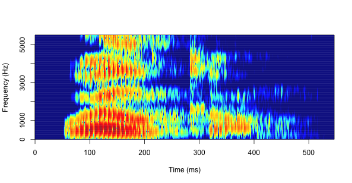

This is how I made the colored spectrogram from the homepage (it's me saying 'welcome'). You need to load the package phonTools into R.


```{r, eval=FALSE}
library(phonTools)
```

Now you have to load the sound you want to make a spectrogram of (it has to be in your working directory). I recorded mine in Praat.

```{r, eval=FALSE}
sound <- loadsound('welcome.wav')
```

Now we're ready to make a spectrogram.

```{r, eval=FALSE}
spectrogram(sound, fs=44100, colors=TRUE, maintitle= "Welcome", maxfreq=5500)
```



We can also see the oscillogram by using

```{r, eval=FALSE}
plot(sound)
```


That's it. 
