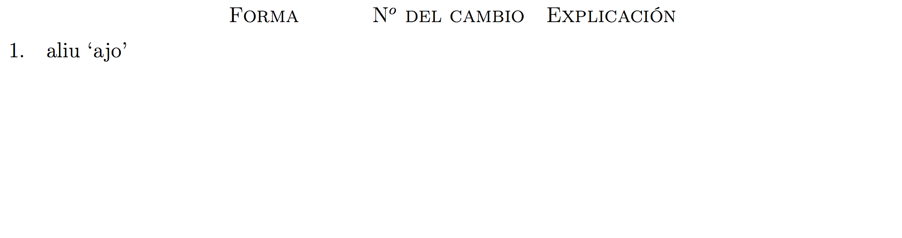
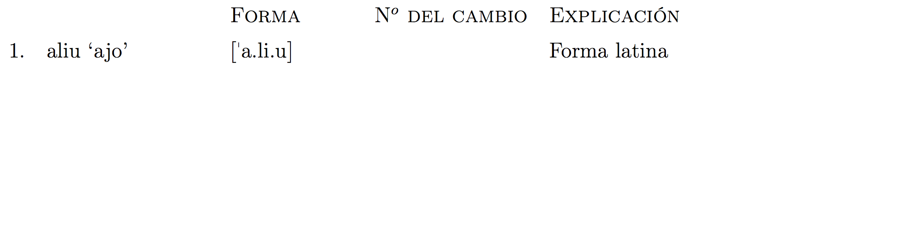
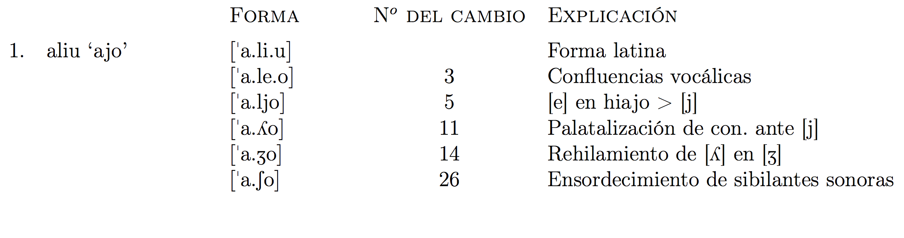

# Repaso histórico

## La reconquista

¿Por qué se estanca?

- La necesidad de consolidar militarmente las victorias del siglo XIII
- La lentitud del proceso de repoblación
- El hecho de que los reyezuelos musulmanes restantes sean vasallos de los monarcas castellanos
- La inestabilidad política

##

## 1492

- La conquista de Granada (final de la reconquista)
- La dominancia de la religión católica (expulsión de los judíos y los musulmanes)
- El 'descubrimiento' del Nuevo Mundo

### Relevancia lingüística

- La diáspora (el sefardí)
- Inmensa expansión de la lengua que conducirá al desarrollo de las variedades americanas

### Relevancia filológica

- Nebrija
    - Diccionario bilingüe (latín-español)
    - El Arte de la lengua castellana

##

<iframe width="640" height="480" src="//www.youtube.com/embed/U53XKRY2qg0" frameborder="0" allowfullscreen></iframe>

## El renacimiento

- La exaltación de las lenguas clásicas = rechazo de las formas medievales
- Supone un intento de imitar estilísticamente los modelos clásicos
    - _hiperbatón_: uso del orden libre de palabras típico del latín
    - _cultismos_: préstamos tomados del latín/griego clásicos

## El siglo de oro

- Todo va bien
- Mucho dinero, mucha tierra
- El Quixote

## El barroco

- caracterizado por la exageración 
- sale el primer diccionario monolingüe
- todo va mal
    - se pierden las colonias (siglo XVIII)
    - la invasión de Napoleón
    - guerras, etc.

##

## La rae

- 1713 
- Surge como reacción a los excesos del Barroco
- Actualmente criticada...
    - por ser demasiado conservadora
    - por centrarse demasiado en español penínsular
- [ASALE](http://www.asale.org)

# Cambios fonológicos

## Cambios vocálicos

- Estabilidad del sistema vocálico

## Cambios consonánticos

- Se reduce el inventario fonémico de forma considerable

## Cambios consonánticos (2)

Consultad pp. 80 y 151

- [23] Pérdida de [h] inicial, proveniente de [f]  
- [24] /b/ y /β/ confluyen en /b/  
- [25] Desafricación de [ts] y [dz]  
- [26] Ensordecimiento de las sibilantes sonoras  
- [27] Cambio de articulación de [s̡]  
- [28] Cambio de articulación de [ʃ] Se hace velar o incluso uvular  
- [29] Yeísmo

## 23. Pérdida de [h] inicial, proveniente de [f] 

- repetición del cambio #2 ([f] > [h])
- [h] > [Ø]
    - farīna [harína] > [arína]

## 24. /b/ y /β/ confluyen en /b/

- la /β/ tiene dos orígenes
    - la desvelarización de [w] (#4) 
        - clāve [klá:we] > [klá:βe]
    - la lenición de /p/ y /b/ latinas (#15)
        - [p] > [b] > [β]: 
            - cūpa [kú:pa] > [kúba] > cuba [kúβa]
            - capra [kápra] > [kábra] > cabra [káβra]
        - [b] > [β]: 
            - cibu [kíbu] cast. med, cevo [tséβo]
- A partir de ahora, [β] se interpreta como alófono de /b/

## 25. Desafricación de [ts] y [dz]

- La desafricación (pérdida de la fase oclusiva) ocurre de forma sistemática en el cuadro de sibilantes
- /ts/ y /dz/ se convierten en fricativas dentales/alveodentales (teóricamente suena como la /s/ de América)
    - braço [brátso] > [brás̡o] 
    - dize [dídze] > [díz̡e]

### Problema

- Ya había dos sibilantes... [ś] y [ź]
    - fablasse [habláśe]
    - casa [cáźa]
- ¿Cómo se distinguen de las sibilantes ya existentes?   
- Las nuevas = alveodentales (más dentales) y se pronuncian con el dorso de la lengua
- Las antiguas = apicoalveolares, como la castellana actual

##

<iframe src="http://www.uiowa.edu/~acadtech/phonetics/spanish/frameset.html" style="width: 750px; height: 430px"
scrolling="no" marginwidth="0" marginheight="0" frameborder="0" vspace="0" hspace="0">
</iframe>

## 26. Ensordecimiento de las sibilantes sonoras

- __/z̡/__, /s̡/, __/ź/__, /ś/, __/ʒ/__, /ʃ/
- Tiene consecuencias fonémicas, ya que se pierde el fonema sonoro de cada uno de estos pares.
- Se extiende del norte al sur en el siglo XVI con la llegada de emigrantes del norte a Madrid

|               | Sonora |     | Sorda | Cambio               |
| :------------ | :----: | --: | :---- | :------------------- |
| alveodental   |  /z̡/   |  >  |  /s̡/  | dize [díz̡e] > [dis̡e] |
| ápicoalveolar |  /ź/   |  >  |  /ś/  | casa [káźa] > [káśa] |
| alveopalatal  |  /ʒ/   |  >  |  /ʃ/  | hijo [íʒo] > [íʃo]   |

## 27. Cambio de articulación de [s̡]

- Se hace interdental [θ]
- braço [brátso] > [brás̡o] > [bráθo] 
- dize [dídze] > [díz̡e] > [dís̡e] > [díθe]

## 28. Cambio de articulación de [ʃ] 

- Se hace velar o incluso uvular
    - hijo [íʒo] > [íʃo] > [íxo]/[íχo]
- Motivos para el cambio de punto de articulación (27 y 28): 
    - Mantener la distinción funcional
    - no todo el mundo está de acuerdo.

## 29. Yeísmo

- todos los casos de [ʎ] se convierten en [ʝ]
- halla y haya se pronuncian igual

## Ej.

Cast. med. _cabeza_ [kaβedza]

|           |    |                          |
| :-------- | -- | :----------------------- |
| /kabédza/ | 24 | confluencia de /b/ y /β/ |
| [kaβéz̡a]  | 25 | desafricación de [dz] |
| [kaβés̡a]  | 26 | ensordecimiento de sibilantes sonoras |
| [kabéθa]  | 27 | cambio del punto de articulación de [s̡] |

Esp. mod. _cabeza_

## Ej.

Cast. med. _fijo_ [híʒo]

|    |    |    |
| -- | -- | -- |
| [íʒo] | 23 | pérdida de [h] inicial |
| [íʃo] | 26 | ensordecimiento de sibilantes sonoras |
| [íxo] | 28 | cambio del punto de articulación |

Esp. mod. _hijo_

## Ej. 

Cast. med. _caballo_ /kaβáʎo/

|    |    |    |
| -- | -- | -- |
| /kabáʎo/ | 24 | confluencia de /b/ y /β/ |
| /kabájo/ | 29 | yeísmo |

Cast. mod. _caballo_

## Preguntas

1. Explica el desarrollo del fonema fricativo interdental sordo /θ/. ¿De dónde viene? ¿Cuáles son los cambios fonológicos relevantes?
2. ¿Cuáles son las diferencias principales entre /s̡/ - /z̡/ y /ś/ - /ź/?
3. ¿Por qué no se pronuncia la 'h' en el español moderno? ¿A qué se debe el uso de este grafema? Explica su desarrollo histórico. ¿Cuáles son los cambios fonológicos relevantes? <!-- ¿En qué sentido es una repetición del cambio #2? -->

## Ej.

## Ej.

## Ej.

## Ej.

## Ej.

## Ej.

## Ej.

## Ej.

##

- El sonido fricativo interdental sordo proviene de un rey ceceante que mandó a todos sus súbditos que hablasen como él. 

1. Reescribid esta oración utilizando una construcción de infinitivo no concertado.
2. Evaluad esta afirmación y decidid si estáis de acuerdo o no. Aportad una explicación histórica para apoyar vuestra postura.

# Cambios morfológicos

##

1. ge lo > se lo 
2. Pérdida de 'el' + femenino con vocal 
3. Pronombres
4. Morfología verbal

##

### 1. ge lo > se lo 

- No sigue el camino esperado
    - [ʒ] > [ʃ] > [x]/[χ]
    - [ʒ] > [ś]
- por semejanza fonética con el 'se' reflexivo
- 'aislamiento gramatical'
    - no puede emplearse sólo
    - carece de un sentido individual claro (es sg. y pl.)
- 'se lo compra'

##

### 2. Deja de usarse 'el' + femenino con vocal 
    
- El espada > la espada
- 'el' + femenino se conserva si empieza por 'a' tónica
    - el hacha
    - el hambre
    - el águila

##

### 3. Pronombres

Castellano medieval tardío

-----------------------------------------
Forma    Singular       Plural
-------- -------------- -----------------
Familiar tu/vos         vosotros         

Formal   vuestra merced vuestras mercedes
-----------------------------------------

 

- el uso de 'uos' es cada vez más reducido 
    - ámbito familiar rural 
    - luego se pierde en la Península también en ese contexto
- Se conserva en latinoamérica en competición con el tuteo (menos en Argentina)

##

Español peninsular actual

-----------------------------------------
Forma    Singular       Plural
-------- -------------- -----------------
Familiar tú             vosotros         

Formal   usted          ustedes
-----------------------------------------

Español americano actual

-----------------------------------------
Forma    Singular       Plural
-------- -------------- -----------------
Familiar tú y/o vos     ustedes         

Formal   usted          ustedes
-----------------------------------------

### Evolución de usted

- Vuestra merced > vuasted > vusted > vuesarced> voarced> usted

### Misc.

- Vosotros, oblicuo > vos > os
- Vosotros se descarta en casi todo el mundo hispano

##

### 4. Morfología verbal

- -ades, -edes, -ides > -áis, -éis, -ís 
- verbos irregulares en 1 pr. sg. (ser, dar, estar, ir)
- raíz + y (ibi 'allí')
    - so (> sum) + y = soy
    - do (> do) + y = doy 
    - estó (> sto) + y  = estoy
    - vo > (> vado) + y = voy

 

- Futuro de subjuntivo reemplazado por el presente de subjuntivo o incluso de indicativo:
    - E podrás yr mas ayna o quisieres 
    - ‘y podrás ir más pronto adonde quieras’
    - Pero si lo fizieres digo te que mas tarde iras 
    - ‘pero si lo haces, te digo que más tarde irás’
- Hoy sólo queda el futuro de subjuntivo en refranes y otras frases hechas: 
    - sea como fuere
    - cuando a Roma fueres, haz como vieres

 

- Pluscuamperfecto de indicativo en –ra en textos medievales:
    - dixerat = dijera 'había dicho'
    - Dixo les de como non le diera el Rey mas de nueue dias de plazo 
    - ‘les dijo cómo el rey no le había dado más de nueve días de plazo.
- Para finales de siglo XV se usa como desinencia de subjuntivo.
    - dijera = imperfecto de subj.

## 

1. ¿Es fonémica la ortografía del español? ¿Por qué? Dad ejemplos. 

2. ¿Cómo se explica el cambio so > soy, estó > estoy?

# Cambios sintácticos

##

1. se finaliza el proceso de gramaticalización de auer
2. ‘a personal’ se hace obligatoria en el siglo XVII
3. La pasiva refleja se usa como hoy en día ya en el siglo XVII
4. Clíticos: Se van estableciendo las reglas actuales
    - Medioevo:
        - antes del verbo precedido de palabras importantes: ser uos emos
        - Después del verbo en otros casos: fallole
    - Hoy en día:
        - Le halló (verbo personal) Hallarle (infinitivo)

##

- Algunas diferencias en esta época:
    1. Dos verbos seguidos, clítico sigue al primero
        - Pero deues me perdonar
        - Hoy en día antes o después: Pero me debes perdonar, debes perdonarme
    2. El clítico no tenía por qué ser contiguo a su verbo. Hoy sí:
        - E fizieron se tan pesados que los non podien traer 
        - Y se hicieron tan pesados que no los podían traer
- El nuevo sistema se impone para finales del siglo XVII, aunque pueden quedar restos en textos literarios como rasgo y estilo arcaizante

# Referencias

## Referencias

- Pharies, D. A. (2010). Breve historia de la lengua española: Spanish edition. University of Chicago Press.
- Colina, S. (2013). Spanish 455: clase notes. University of Arizona. 

