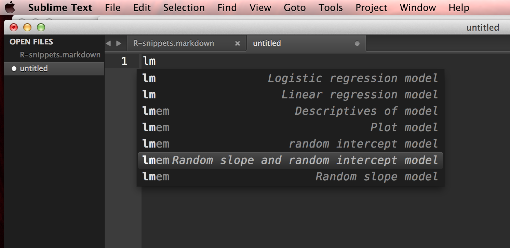

+++
# Date this page was created.
date = "2016-04-27"

# Project title.
title = "R-Snippets"

# Project summary to display on homepage.
summary = "A collection of snippets that I use in SublimeText for doing statistical analysis in R"

# Optional image to display on homepage (relative to `static/img/` folder).
image_preview = "thumbnails/lm.png"

# Tags: can be used for filtering projects.
# Example: `tags = ["machine-learning", "deep-learning"]`
tags = ["r", "sublimetext", "snippets", "workflow"]

# Optional external URL for project (replaces project detail page).
external_link = ""

# Does the project detail page use math formatting?
math = false

# Optional featured image (relative to `static/img/` folder).
[header]
image = "thumbnails/lm.png"
caption = ":smile:"

+++


<iframe src="http://ghbtns.com/github-btn.html?user=jvcasillas&repo=R-snippets&type=watch&count=true&size=large" height="30" width="170" frameborder="0" scrolling="0" style="width:130px; height: 30px;" allowTransparency="true"></iframe>
<iframe src="http://ghbtns.com/github-btn.html?user=jvcasillas&repo=R-snippets&type=fork&count=true&size=large" height="30" width="170" frameborder="0" scrolling="0" style="width:130px; height: 30px;" allowTransparency="true"></iframe>
<iframe src="http://ghbtns.com/github-btn.html?user=jvcasillas&type=follow&count=true&size=large" height="30" width="240" frameborder="0" scrolling="0" style="width:240px; height: 30px;" allowTransparency="true"></iframe>

<p></p>

This repository is a collection of snippets that I use in [SublimeText] [SublimeText] for doing statistical analysis in [R][R]. The goal is straightforward: document the code that I use most often while doing linguistic research and make it readily available (and understandable) to other linguists. If you are interested in helping see the github [repository](https://github.com/jvcasillas/R-snippets). To install R-snippets see the [package control][package control R-snippets] page. To use a snippet, type the trigger and hit the tab key. For example, typing <code>lm</code> brings up the following window:  



Selecting ```Random slope and random intercept model``` expands to...

```r
# load lme4 for mixed models
library(lme4)

# random intercept and random slope model
modelName = lmer(DV ~ fixedFactor1 +* fixedFactor2 + (1 + randomSlope|randomInt), data=df)
modelName

hist(residuals(modelName))
qqnorm(residuals(modelName))
qqline(residuals(modelName))
```

Main triggers:  

- "plot": templates for plotting in base R
- "edit": options useful for data cleansing and saving
- "desc": descriptive statistics of data
- "ttest": distinct types of t-test
- "aov": distinct analysis of variance models
- "lm": linear and logistic regression
- "lmem": linear mixed effects models

Extras:  

- "subset": make subsets of a DF
- "read": read/load/install data/packages into R
- "save": save plots, dfs, tables, etc.
- "tikz": template for creating R plots in LaTeX


<!-- links -->

[SublimeText]: http://www.sublimetext.com
[R]: http://www.r-project.org
[package control R-snippets]: https://sublime.wbond.net/packages/R-snippets
