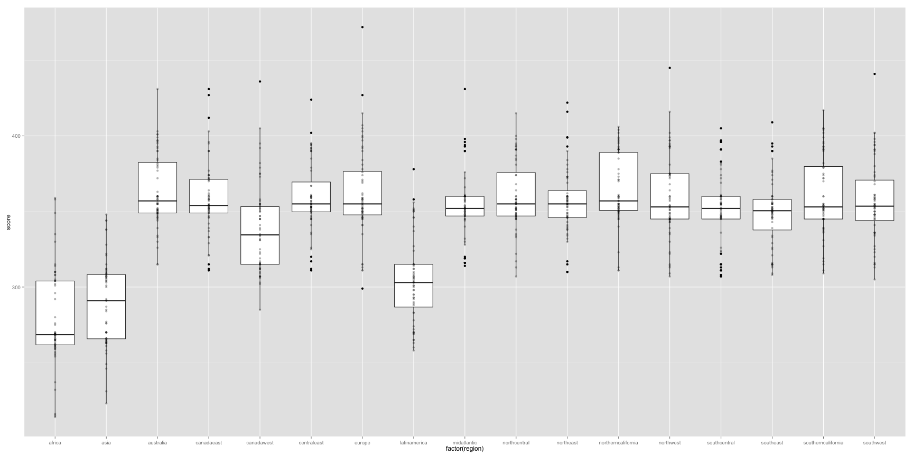
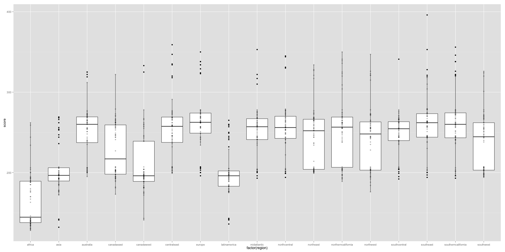

# Results - overall


## Overall men

```r
knitr::kable(head(data_men_overall, 60), row.names=FALSE)
```

```
## Error: object 'data_men_overall' not found
```

## Overall women


```r
knitr::kable(head(data_women_overall, 60), row.names=FALSE)
```

```
## Error: object 'data_women_overall' not found
```

## Average scores

| Workout    | 14.1 | 14.2 | 14.3 | 14.4 | 14.5 |
|:-----------|:-----|:-----|:-----|:-----|:-----|
| Men | 406.5 (18.6398) | 302.5833 (34.0534) | 160.55 (8.4541) | 242.3167 (12.0317) | NA |
| Women | 397.1 (22.4641) | 258.8167 (46.0293) | 168.6833 (10.6014) | 198.4333 (9.965) | NA |

# Results - by region


```
## Error: no lines available in input
```

## Men

| Region    | 14.1 | 14.2 | 14.3 | 14.4 | 14.5 |
|:-----------|:-----|:-----|:-----|:-----|:-----|
| Africa | 329.2667 (27.7017) | 165.3167 (34.0157) | 140.8667 (6.9659) | 191.85 (7.7674) | NA |
| Asia | 345.0833 (21.7445) | 203.75 (32.162) | 141.8833 (8.6124) | 198.3333 (11.3252) | NA |
| Australia | 384.2333 (19.6394) | 251.6 (33.5772) | 150.75 (6.8063) | 224.9333 (16.2156) | NA |
| Canada East | 368.8333 (17.2766) | 228.2167 (34.1508) | 149.3333 (6.7036) | 206.75 (13.2609) | NA |
| Canada West | 361.9333 (23.0393) | 209.5 (38.014) | 148.4333 (7.4909) | 201.9 (14.3936) | NA |
| Central East | 379.2833 (22.201) | 254.7833 (38.2636) | 152.5333 (7.7251) | 217.2833 (17.6088) | NA |
| Europe | 381.9167 (18.8916) | 263.4667 (35.6834) | 150.5333 (6.786) | 224.75 (17.4255) | NA |
| Latin America | 342.2167 (19.297) | 198.6333 (30.4013) | 141.2667 (5.6595) | 196.3833 (7.7724) | NA |
| Mid Atlantic | 375.5333 (22.9749) | 252.1667 (30.9073) | 152.5833 (8.599) | 213.2333 (17.3267) | NA |
| North Central | 383.95 (18.2538) | 255.05 (32.5932) | 153.1667 (8.07) | 215.2333 (15.1438) | NA |
| North East | 380.8833 (19.4074) | 244.7833 (36.8327) | 153.75 (8.3354) | 216.1667 (16.1299) | NA |
| Northern California | 379.8833 (19.5778) | 253.25 (41.8515) | 149.9333 (6.8119) | 215 (17.3577) | NA |
| North West | 374.1167 (19.5527) | 242.65 (40.1205) | 149.6833 (7.3703) | 207.8167 (15.4212) | NA |
| South Central | 379.1333 (19.4103) | 247.6333 (26.4428) | 151.2333 (6.1406) | 209.2 (12.4992) | NA |
| South East | 380.65 (20.0447) | 260.95 (37.327) | 152.4 (6.7175) | 221.1333 (15.859) | NA |
| Southern California | 383.95 (20.7131) | 261.7333 (39.2147) | 150.6833 (6.2259) | 220.1167 (14.797) | NA |
| South West | 374.0667 (23.7093) | 238.0333 (35.7145) | 150.3667 (8.1261) | 206.7833 (13.6966) | NA |

## Women

| Region    | 14.1 | 14.2 | 14.3 | 14.4 | 14.5 |
|:-----------|:-----|:-----|:-----|:-----|:-----|
| Africa | 278.3667 (31.5353) | 96.2333 (28.5065) | 131.3333 (13.0717) | 176.6 (6.8425) | NA |
| Asia | 289.4667 (28.4923) | 100 (33.0716) | 132.1 (12.823) | 180.6167 (2.7252) | NA |
| Australia | 363.5167 (23.9813) | 193.85 (49.7989) | 153.0167 (10.1305) | 190.5333 (9.015) | NA |
| Canada East | 359.2833 (24.7126) | 189.8 (53.9425) | 152.8667 (10.0582) | 188.6333 (4.2862) | NA |
| Canada West | 338.1333 (29.1986) | 149.4 (31.5719) | 149.8667 (10.9521) | 184.9333 (3.4042) | NA |
| Central East | 359.4167 (23.2796) | 201.0333 (43.7338) | 157 (11.9206) | 190.8667 (6.4189) | NA |
| Europe | 361.8167 (30.3033) | 192.2 (48.1857) | 152.5333 (10.4305) | 190.05 (10.1954) | NA |
| Latin America | 305.0333 (28.8279) | 130.3167 (27.6893) | 137.75 (8.9265) | 181.6333 (2.4972) | NA |
| Mid Atlantic | 353.75 (22.092) | 197.2667 (36.1686) | 157.55 (10.3161) | 189.45 (3.7796) | NA |
| North Central | 359.6167 (22.9466) | 202.2167 (41.4876) | 154.0167 (9.8057) | 188.9 (3.9475) | NA |
| North East | 356.6333 (22.4959) | 204.2667 (38.1864) | 155.7167 (9.5706) | 189.0667 (4.0121) | NA |
| Northern California | 364.0333 (23.2867) | 210.0833 (41.2349) | 153.6167 (8.7568) | 190.8333 (5.2599) | NA |
| North West | 358.95 (27.7845) | 187.45 (37.8155) | 154.9667 (9.9898) | 187.7333 (5.181) | NA |
| South Central | 351.5833 (24.364) | 197.25 (40.1449) | 152.7167 (8.2854) | 188.7 (3.8939) | NA |
| South East | 349.4167 (22.7717) | 198.65 (41.0877) | 151.6667 (8.071) | 188.3167 (5.9161) | NA |
| Southern California | 360.1667 (26.3086) | 200.8333 (46.4259) | 155.2333 (11.992) | 189.0167 (5.3282) | NA |
| South West | 356.4167 (26.4096) | 195.25 (36.7952) | 154.9833 (9.3871) | 188.4667 (4.575) | NA |


# Graphs

## 14.1


```r
library(ggplot2)
wod14_1m <- subset(df_final, wod=="14_1" & gender=="m")
wod14_1f <- subset(df_final, wod=="14_1" & gender=="f")
m14_1 <- ggplot(wod14_1m, aes(factor(region), score))
m14_1 + geom_boxplot() +
    geom_point(alpha = 3/10)
```

 

```r
f14_1 <- ggplot(wod14_1f, aes(factor(region), score))
f14_1 + geom_boxplot() +
    geom_point(alpha = 3/10)
```

 

## 14.2


```r
wod14_2m <- subset(df_final, wod=="14_2" & gender=="m")
wod14_2f <- subset(df_final, wod=="14_2" & gender=="f")
m14_2 <- ggplot(wod14_2m, aes(factor(region), score))
m14_2 + geom_boxplot() +
    geom_point(alpha = 3/10)
```

 

```r
f14_2 <- ggplot(wod14_2f, aes(factor(region), score))
f14_2 + geom_boxplot() +
    geom_point(alpha = 3/10)
```

 

## 14.3


```r
wod14_3m <- subset(df_final, wod=="14_3" & gender=="m")
wod14_3f <- subset(df_final, wod=="14_3" & gender=="f")
m14_3 <- ggplot(wod14_3m, aes(factor(region), score))
m14_3 + geom_boxplot() +
    geom_point(alpha = 3/10)
```

 

```r
f14_3 <- ggplot(wod14_3f, aes(factor(region), score))
f14_3 + geom_boxplot() +
    geom_point(alpha = 3/10)
```

 

## 14.4


```r
wod14_4m <- subset(df_final, wod=="14_4" & gender=="m")
wod14_4f <- subset(df_final, wod=="14_4" & gender=="f")
m14_4 <- ggplot(wod14_4m, aes(factor(region), score))
m14_4 + geom_boxplot() +
    geom_point(alpha = 3/10)
```

 

```r
f14_4 <- ggplot(wod14_4f, aes(factor(region), score))
f14_4 + geom_boxplot() +
    geom_point(alpha = 3/10)
```

 

# References

- ref 1

