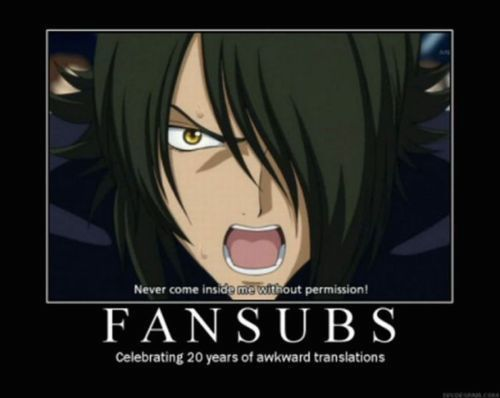
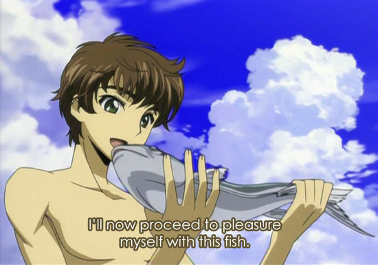

# Overview

## Problem 

How do you say VOT in Spanish?

 

- Technical fields with specialized terminology need translations 

- Many fields don't have satisfactory translations into many langauges

- Most academics aren't translators

## Proposal

 

- We can learn from anime

- Fansubs represent a subculture that has dealt with similar problems

- The fansub model can be used for technical translations

##

##

##  Purpose

- Translate linguistic terminology in Romance languages

- Provide community forum for consulting/suggesting/discussing translation

- Made by end-user for end-user (i.e. linguists)

##  Current practices

- Reverse wikipedia + google search

- Find articles/books

- Ask a prof/advisor/lab buddy

- Wing it

##  Problems with current practices

- Wikipedia only has entries in russian

- No pertinant articles/books in TL
    
- Prof/advisor/lab buddy doesn't know/care

- (linguistic) God complex

    - reliance on specific translation because it's what somebody else said first (Chomsky, Bosque, etc.)
    
    - doesn't take into account that it might not be a good translation

##  What we need
 

- Forum where end-users (linguists) discuss, propose and rate translations of linguistic terminology

 

###  Possible consequences:

 

- Creates a database that formed by linguists that can be accessed by linguists (students, profs)

- Eliminates God complex?

# Fansubs

## What are they?

- definition fo some sort

##

<iframe width="960" height="720" src="//www.youtube.com/embed/9w-aeU0KwuE" frameborder="0" allowfullscreen></iframe>

##

<iframe width="960" height="720" src="//www.youtube.com/embed/SwSU7Y8xb-Y" frameborder="0" allowfullscreen></iframe>

## 

## Why?

## TS issues

## Equivalence

- cosas
- cosas

## (in)visibility of the translator

- cosas
- cosas

## So what?

- community-based translations can help avoid problems involved with translation of techinical terminology

# lingreference.org

## The interface

## KISS

- Minimalist design

- Intuitive

- Accesible from mobile devices

## {data-background-image="../images/home.png"}

## {data-background-image="../images/entry.png"}

## {data-background-image="../images/null.png"}

# Database

## How it works

- User submissions

- Staging

- Revision

- Inclusion

## {data-background="#000000"}

<iframe width="1100" height="900" src="//www.lingreference.org" frameborder="0" allowfullscreen></iframe>

## 

## Searching

- Query sent to database through PHP

- Database searched for 'x' term

- Result sent back to webpage through PHP

## 

## Submission process

- Required info collected for each submission

    - SL entry
    - TL entry
    - meaning
    - example usage
    - references
    - tags

# Roadmap

## Functionality

- Rating system
    - 'thumbs up'/'thumbs down'
    - Display % 'thumbs up' with each entry
    - Rating occurs in entry, but accessible from forum
- Include multiple possibilities/translations for each entry (if suggested by users)
    - Ex.
        - English: 'voice-onset time'
        - Spanish: 'tiempo de inicio de sonoridad'/'tiempo de inicio de fonación'
    - Entries listed vertically, in order of highest rating
- Entry count in 'about' section

## Functionality

- Google form to submit entries (same excel as staging)
    - Submissions come from:
        - forum
        - search results (if it's not there, they can add it)
- Definitions
    - Include English definition with each entry

# Goals

## 

## Short term

- Functional dictionary with limited entries

- Build forum

- Promote to linguists

    - facebook
    
    - twitter

## Long term

- Become principle reference for linguistic terminology in Romance

- Grow user base

- Serve as model for language revitalization projects

- open source code (github)

## References

- lots
- and lots

NOTES
- the community establishes authority (Kiraly 2003)