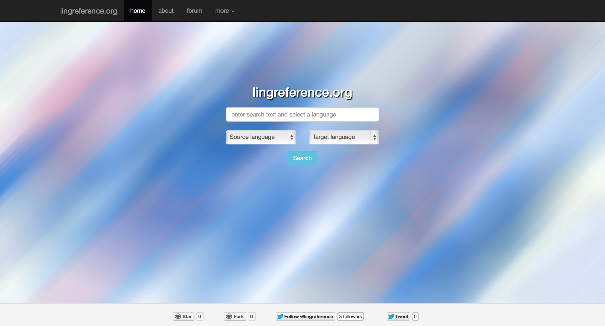
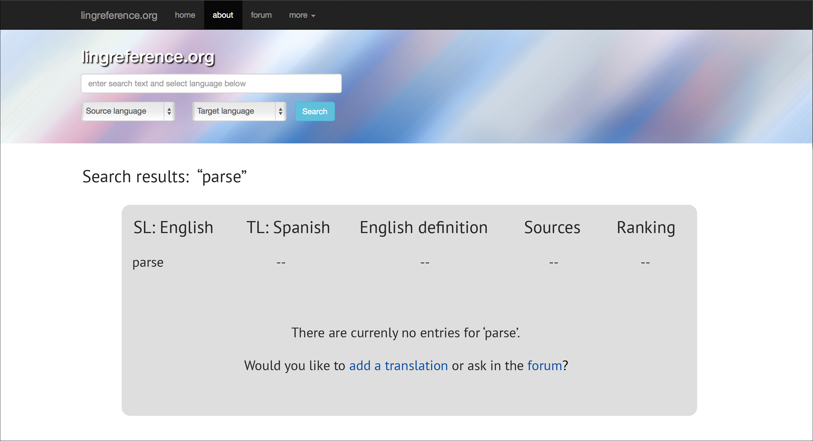

# Overview

## Purpose

- Translate linguistic terminology in Romance languages
- Provide community forum for consulting/suggesting/discussing translation
- Made by end-user for end-user (i.e. linguists)

# The interface

## KISS

- Minimalist design
- Intuitive
- Accesible from mobile devices

##

##

##

# Database

## How it works

- User submission
- Staging
- Revision
- Inclusion

##

## Searching

- Query sent to database through PHP
- Database searched for 'x' term
- Result sent back to webpage through PHP

##

# Roadmap

## Functionality

- rating system
    - 'thumbs up'/'thumbs down'
    - display % 'thumbs up' with each entry
    - rating occurs in entry, but accessible from forum
- include multiple possibilities/translations for each entry (if suggested by users)
    - Ex.
        - English: 'voice-onset time'
        - Spanish: 'tiempo de inicio de sonoridad'/'tiempo de inicio de fonación'
    - Entries listed vertically, in order of highest rating
- entry count in 'about' section
- google form to submit entries (same excel as staging)
    - from forum
    - from search results
- Definitions
    - include English definition with each entry
    - expand to other languages? (probably not)

# Goals

## Short term

- Functional dictionary with limited entries
- Build forum
- Promote to linguists
    - facebook
    - twitter

## Long term

- Become principle reference for linguistic terminology in Romance
- Grow user base
- Serve as model for language revitalization projects
    - open source code (github)
    - article (Comanche)

