# Repaso

---

- Vocabulario
    - el hotel
    - los números
- Verbos irregulares
    - e > ie
    - e > i
    - o > ue
    - u > ue
    - verbos -go

---

Recordad...

> - la bota
	- las formas nosotros y vosotros no tienen cambio de raíz
> - verbos -go cambian en forma de yo
	- salir > salgo

---

- Actividad 2-28 p. 77
- Actividad 2-30 p. 77

# Puentes Capítulo 3 - “Entre familia”

## El plan

  

- Vocabulario:
    - preguntas para el juez Garzón
    - descripciones
- Gramática:
	- Los adjetivos
	- Los adjetivos comparativos
	- Los adjetivos superlativos
- Estrategias para la comunicación oral

## ¿Cómo son las personas?: las descripciones personales

  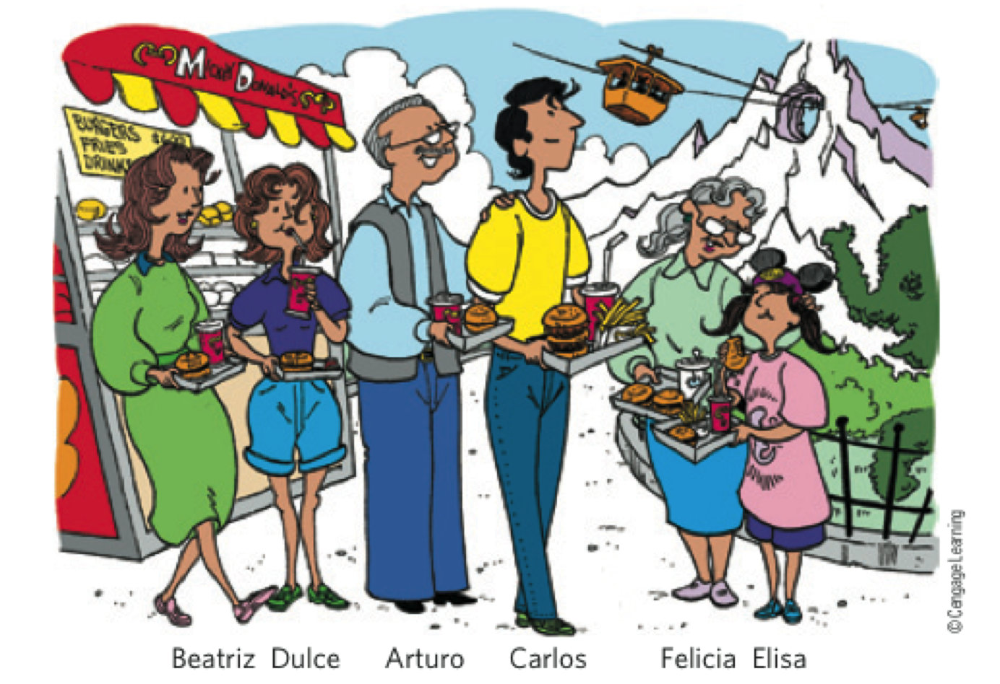

 

- ¿Cómo son estas personas?

- Haz una lista de adjetivos útiles

<!-- track 1-52 con compa;ero primero, luego con el audio -->

## Vocabulario útil: los rasgos físicos

  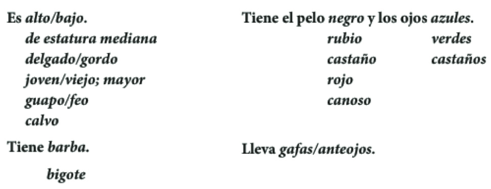

## Vocabulario útil: la personalidad y el carácter

  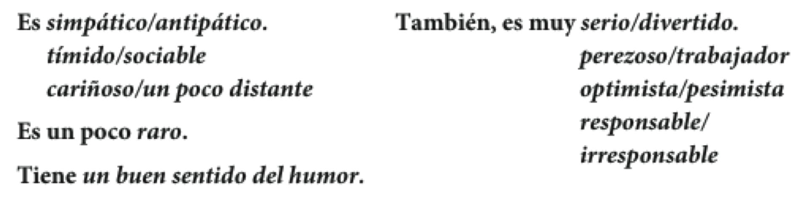

## Los adjetivos: la concordancia de número y género

  

- Los adjetivos **concuerdan** con sus respectivos sustantivos en cuanto al **número** y al **género**

> - *Dulce* es muy bonit**a**. 
> - Es simpátic**a** pero muy seri**a**.
> - Es muy amable y trabajador**a**.
> - Tiene *el pelo* castañ**o**.

## Los adjetivos: la concordancia de número y género

  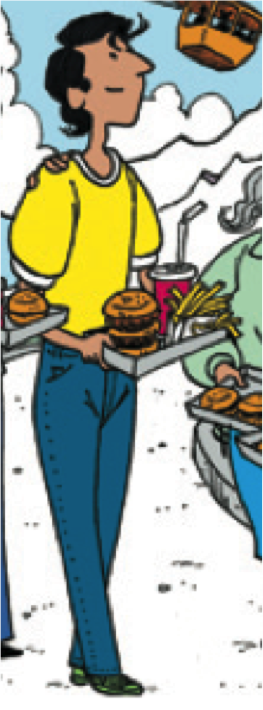

- Los adjetivos **concuerdan** con sus respectivos sustantivos en cuanto al **número** y al **género**

> - *Carlos* es muy alt**o** y guap**o**. 
> - Es tímid**o** pero muy divertid**o**.
> - Es muy responsable y optimista. (¡ojo aquí!)
> - Tiene el pelo negr**o**.

## Más sobre los adjetivos

----------------------------------------------------------------------------
Adjetivos   Masculino                       Femenino
----------- -------------- ---------------- --------------- ----------------
termina en: **Singluar**   **Plural**       **Singluar**    **Plural**

-o          alt**o**       alt**os**        alt**a**        alt**as**

-e          amabl**e**     amabl**es**      amabl**e**      amabl**es** 

consonante  informa**l**   informa**les**   informa**l**    informa**les**

-dor        trabaja**dor** trabaja**dores** trabaja**dora** trabaja**doras**

-ista       optim**ista**  optim**istas**   optim**ista**   optim**istas** 
----------------------------------------------------------------------------

# Descanso (10 minutos)

  

## Más sobre los adjetivos

> - En general, ponemos los adjetivos **después** de los sustantivos
	- Tiene el *pelo* **negro** y los *ojos* **grandes** y **azules**.

 

> - Algunos adjetivos **especiales** pueden aparecer **antes**.
	- Un **buen** *hombre*.
	- Un **mal** *ejemplo*.
	- Unos **buenos** *amigos*.

## Más sobre los adjetivos

- El adjetivo **grande** tiene dos significados que varían según su posición...
	- Una **gran** universidad.
	- Una universidad **grande**. 

> - Ejercicio 3-6, p. 94
> - Ejercicio 3-8, p. 95

# Los comparativos y los superlativos

## Las comparaciones de superioridad:

*más* + (**adjetivo**, **adverbio**, **sustantivo**) + *que*  

  

   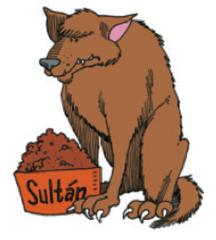  
  

  

   	
  

 

> - Sultán es *más* **grande** *que* Preciosa.
> - Sultán come *más* **rápidamente** *que* Preciosa.
> - Sultán tiene *más* **energía** *que* Preciosa.

## Las comparaciones de inferioridad:

*menos* + (**adjetivo**, **adverbio**, **sustantivo**) + *que*  

  

   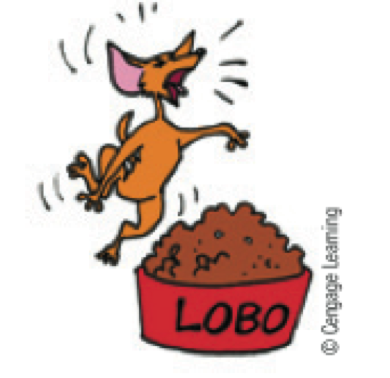  
  

  

   	
  

 

> - Lobo es *menos* **grande** *que* Preciosa.
> - Lobo duerme *menos* **tranquilamente** *que* Preciosa.
> - Lobo tiene *menos* **juguetes** *que* Preciosa.

## Las comparaciones irregulares:

> - Lobo es **menor** que Preciosa.

> - Preciosa es **mayor** que Lobo.

> - La personalidad de Preciosa es **mejor** que la personalidad de Lobo.

> - La personalidad de Lobo es **peor** que la personalidad de Sultán.

## Las comparaciones de igualdad:

*tan* + (**adjetivo**, **adverbio**) + *como*  

  

     
  

  

   	
  

 

> - Lobo es *tan* **malo** *como* Sultán.

> - Lobo corre *tan* **rápidamente** *como* Sultán.

## Las comparaciones de igualdad:

*tanto(s), tanta(s)* + (**sustantivo**) + *como*  

     
  

  

   	
  

 

> - Lobo tiene *tantos* **juguetes** *como* Sultán.

> - Lobo tiene *tanta* **energía** *como* Sultán.

> - ¡OJO! Lobo come **tanto como** Sultán.

## Los superlativos expresan los extremos

*el, la, los, las* + (**sustantivo**) + *más/menos* +  (**adjetivo**) de un grupo

  

     
  

  

   	
  

 

> - Sultán es *el* **perro** *más* **grande** de los tres.
> - Lobo es *el* *menos* **grande** pero *el* *más* **feroz** del grupo.

## Ejercicios

- 3-12

# Repaso

---

- Vocabulario:
	- descripciones
- Gramática:
	- Los adjetivos
	- Los adjetivos comparativos
	- Los adjetivos superlativos
- Estrategias para la comunicación oral

<!-- Ejercicios opcionales
    - CA3-1
    - CA3-4
    - CA3-7
    - CA3-8
    - CA3-9 -->

## Con un compañero...

> - Actividad 2-29 p. 77
> - Actividad 3-13 p. 98

## El plan

  

- Vocabulario:
    - La familia 
- Gramática
    - Ser y estar
- Instrucciones Examen Oral 1
- Estrategias para la comunicación oral

## Repasito

  

  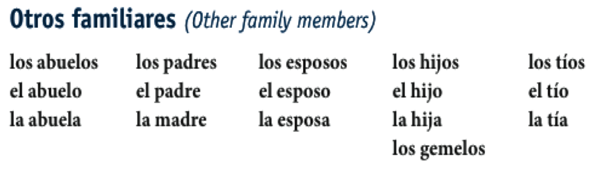

## La familia

  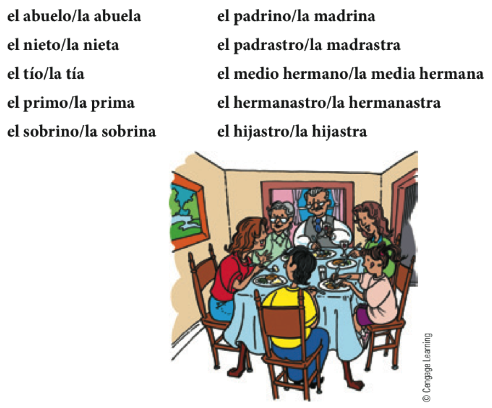

  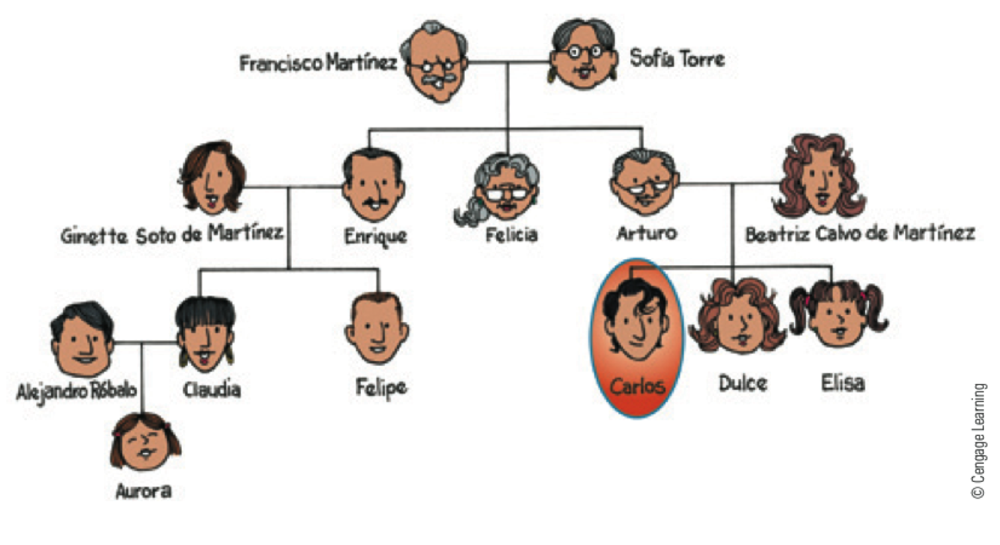

<!-- track 1-49 -->

## Mi árbol genealógico

> - En una hoja de papel dibujad una imagen de ti mismo.
> - Debajo de la imagen, pon tu nombre.
> - Intercambiar hojas con un vecino.
> - Descríbele tu familia para que él/ella pueda rellenar tu árbol.
> - Devuelve la hoja y haz las correcciones necesarias.
> - Comparte con la clase la descripción del árbol

## Las mascotas

  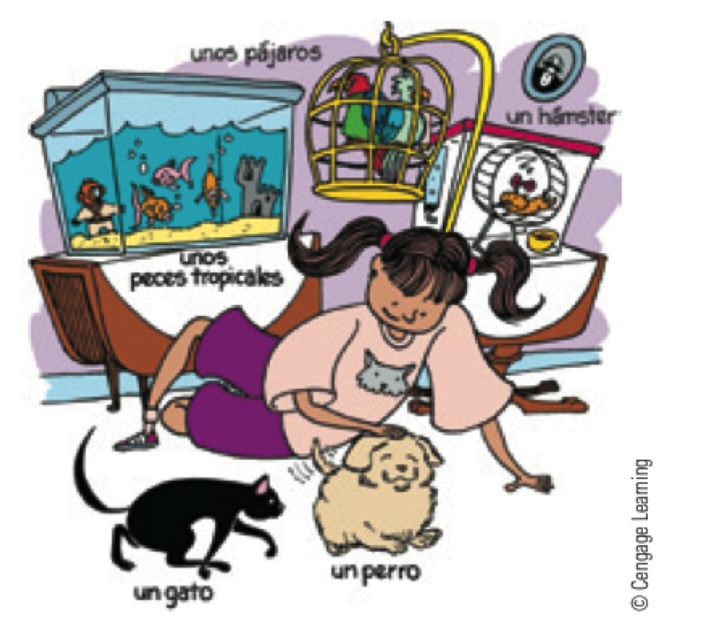

 

- ¿Cuántas mascotas tienes?

- ¿Qué tipos de mascotas hay en tu casa?

<!-- track 1-50 -->

# Descanso (10 minutos)

  

# Ser y estar

## El verbo ser: para identificar y clasificar

  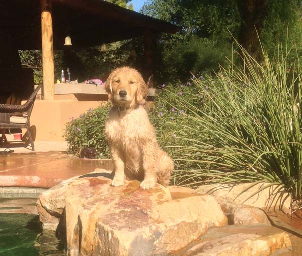

> - Maya **es** mi perra.

> - Mi hermana **es** enfermera.

> - Yo **soy** lingüista.

> - Tú **eres** estudiante.

> - Jing **es** de Slytherin.

## El verbo ser: para describir características con los adjetivos

     
  

  

       
  

 

> - Sultán **es** grande y feroz.

> - Sultán y Lobo **son** buenos perros.

## Los usos del verbo ser: con la preposición "de"

  

> - **Posesión**
    - ¿De quién **es** el cuarto? **Es** de Alicia.

 

> - **Origen**
    - ¿De dónde **es** Manel? **Es** de España.

## Los usos del verbo ser: con la HORA y el LUGAR de los eventos

  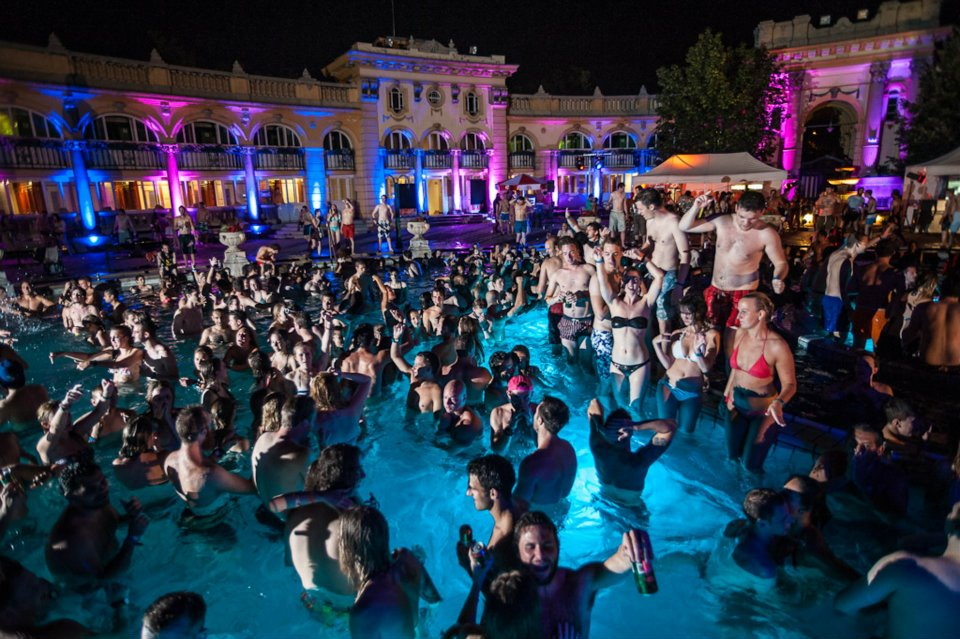

 

> - ¿Cuándo **es** la fiesta?

> - **Es** el sábado a las siete de la noche.

> - La fiesta **es** en la casa del profesor.

## Los usos del verbo estar: la ubicación de las cosas

  

 

> - ¿Dónde **está** el profe?

> - **Está** en el gran cañón.

## Los usos del verbo estar: para describir una condición

  

 

> - ¿Cómo **está** Jackie Chan?

> - **Está**...

## Ser y estar: las características versus las condiciones

  

 

¿Cómo **es** Jackie Chan?  

> - **Es** bajo con pelo negro.
> - **Es** simpático.

¿Cómo **está** Jackie Chan?  

> - **Está** confundido.
> - **Está** frustrado.

## Ejercicios

> - Actividad 3-24, p. 107
> - Actividad 3-25, p. 108
> - Actividad 3-26, p. 108

## Estrategias para la comunicación oral

 
 

- Con un compañero haz una lista de 4 o 5 cosas que puedes hacer para mejorar la comunicación oral.
- Piensa en estrategias que puedes practicar sólo, con otras personas, en casa, en clase, etc. 

## Instrucciones Examen Oral 1

# Repaso

---

- Vocabulario:
    - La familia 
- Gramática
    - Ser y estar
- Instrucciones Examen Oral 1
- Estrategias para la comunicación oral

<!-- Ejercicios opcionales
- Actividad 3-26, p. 108
- CA3-15
- CA3-16
 -->

## El plan

  

- Vocabulario:
    - Los muebles la casa
    - La rutina
- Gramática:
    - Reflexivos
    - El participio pasado
- Preparación Examen Oral 1: individual (capítulos 1, 2 y 3)

## ¿Dónde vive la familia?: la casa

  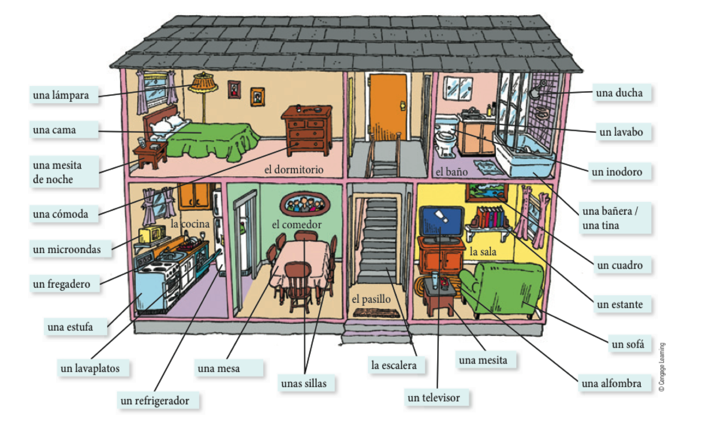

## ¿Cómo es la casa?: describir características de la casa

  

  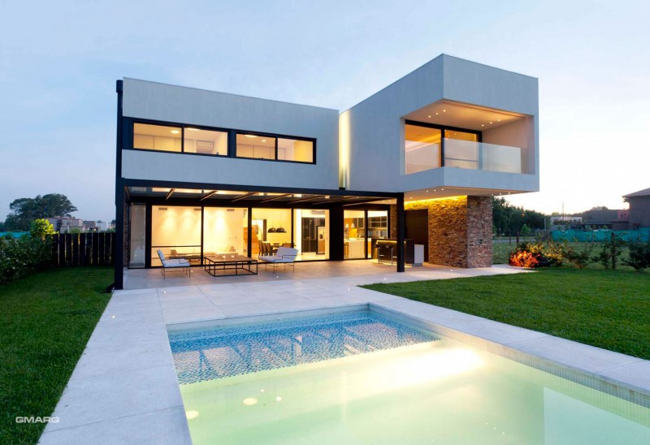
  

  

  
  

 

> - Mi casa es **nueva** (**vieja**).
> - La sala es **grande** y **cómoda**.
> - Los muebles son **elegantes**.

## ¿Cómo es la casa?: describir la casa, los cuartos y los muebles

  

  
  

  

  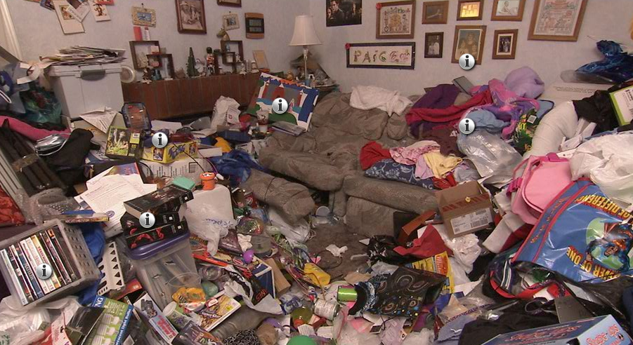
  

 

> - Normalmente, mi cuarto está **ordenado** (**desordenado**).
> - Por lo general, la cocina está **limpia**.
> - Por desgracia, el **refrigerador** está **descompuesto** y la **ventana** está **rota**.

## Las relaciones espaciales - ¿Dónde está el gato

  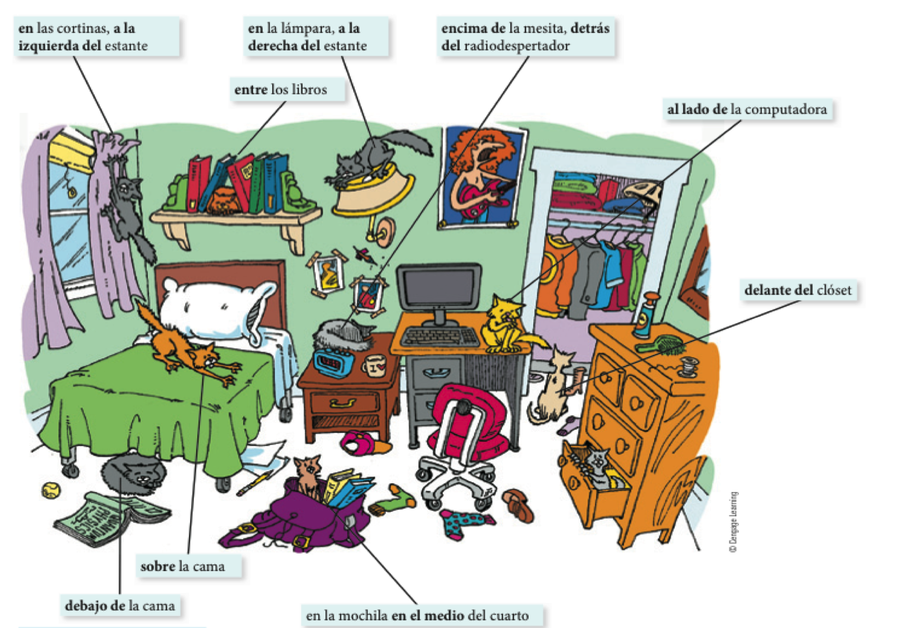

## Ejercicios

- 3-21 p. 105 (audio)

- 3-22 p. 105

## Un día ajetreado: la rutina diaria

- Por la mañana...

  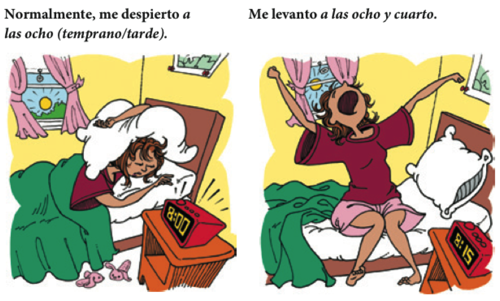

## Un día ajetreado: la rutina diaria

- Por la mañana...

  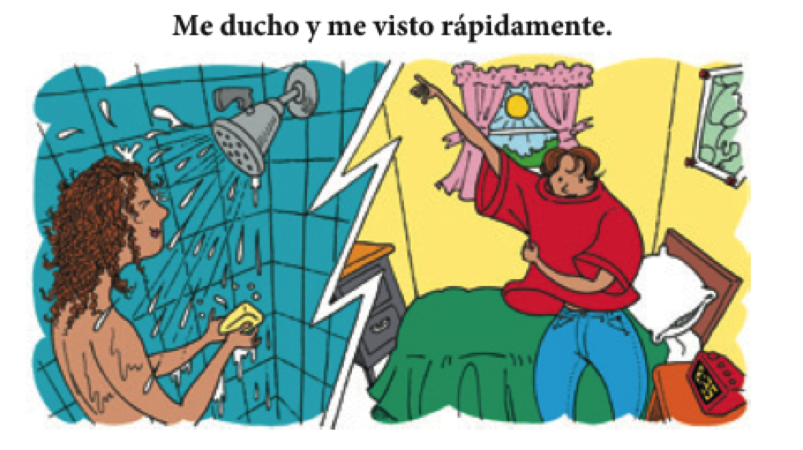

## Un día ajetreado: la rutina diaria 

  

## Un día ajetreado: la rutina diaria

- Por la tarde...

  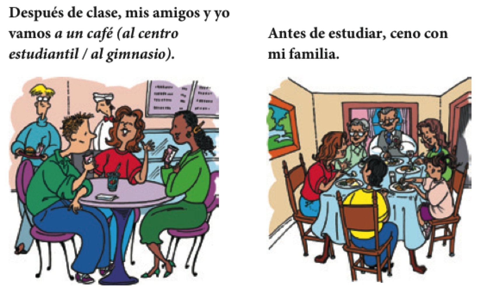

## Un día ajetreado: la rutina diaria

- Por la noche...

  

## Ejercicios

- 3-29, p. 111 (audio)

- 3-30, p. 111

# Descanso (10 minutos)

  

# Los verbos reflexivos

## Los verbos reflexivos: el sujeto y el objeto son la misma persona

  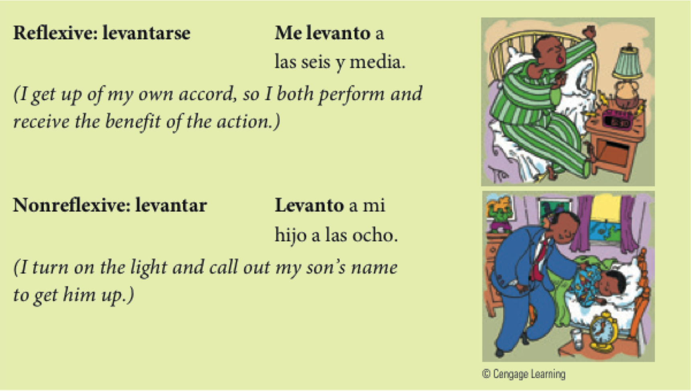

## Los pronombres reflexivos reflejan el sujeto de la frase

  

 

> - Prefiero levantar**me** temprano.
> - Me lavo **LOS** dientes todos los días.

## Los verbos regulares:

  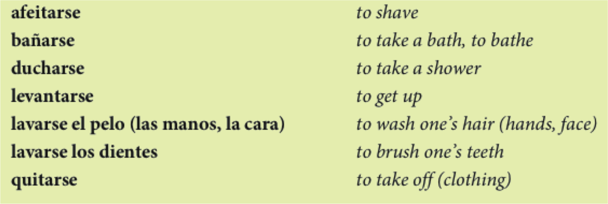

## Los verbos irregulares

  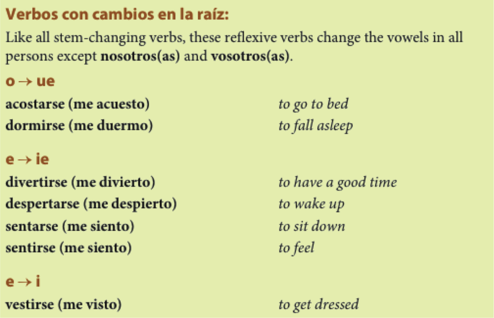

## Ejercicios

- 3-33, p. 115

- 3-34, p. 115

## JT

  <iframe width="420" height="315" src="videos/reflexivo.mp4" frameborder="0" allowfullscreen></iframe>

## Preparación Examen Oral 1: individual (capítulos 1, 2 y 3)

> - Eres el/la profesor/a. Escoge dos o tres preguntas de cada capítulo y házselas a tu compañero (ver hoja de ayer)
> - Presta atención al vocabulario que necesitas, que olvidas, etc.
> - Apunta cuántas veces tu compañero tiene que pausar, pensar, etc. ¿Parece fluido?
> - Proporciónale una nota a tu compañero y dale sugerencias para mejorar.

# Repaso

---

- Vocabulario:
    - Los muebles la casa
    - La rutina
- Gramática:
    - Reflexivos
    - El participio pasado
- Preparación Examen Oral 1: individual (capítulos 1,2 y 3)
