<!-- 
- repaso de OD OI
- intro cap 5 (vocab)
- el presente perfecto
- interesar, encantar, futuro
 -->

## ¿Qué pasa?

  

 

> - El perro come *las pelotas de tenis*

> - *Las* come. 

## ¿Qué pasa?

  

 

> - Andrés **le** da *una manzana* **a Rebeca**.

> - **Se** *la* da.

## ¿Qué pasa?

  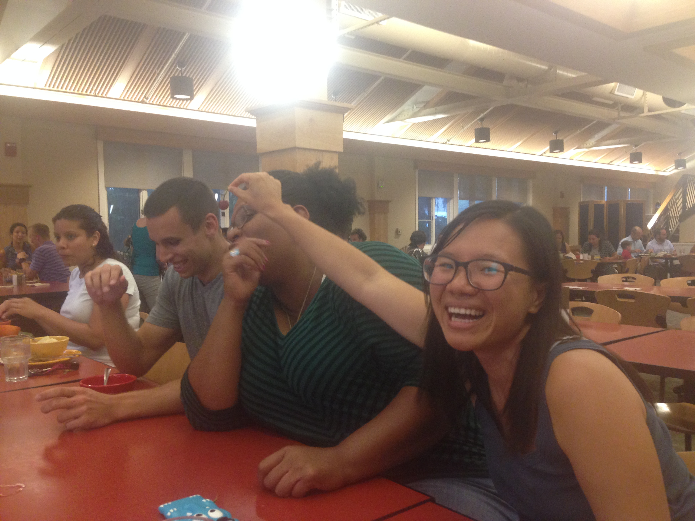

 

> - Jing **le** da *uvas* **a Kim**.

> - **Se** *las* da.

## ¿Qué pasa?

  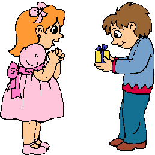

 

> - El niño **le** va a regalar *una sorpresa* **a la niña**.

> - **Se** *la* va a regalar.  
> - Va a regalár**se***la*.

## ¿Qué pasa?

  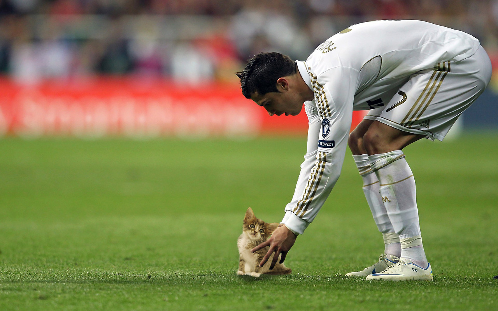

## ¿Qué pasa?

  

## El plan

  

- Vocabulario
	- El horario
	- Pedir y dar opiniones 
	- Las profesiones

- Gramática 
	- El presente perfecto
	- Encantar, interesar
	- Estrategias para hablar del futuro
- Como preparar una presentación con elementos visuales

---

> - **Diego**: ¿Has comprado el vino para la fiesta? 

> - **Ada**: Sí, y también he preparado las tapas. 

> - **Diego**: Y el postre, ¿has hecho algún postre especial? 

> - **Ada**: Sí, he preparado una torta de chocolate. 

> - **Diego**: Gracias, mi amor. Me encanta la torta de chocolate.

## El presente perfecto

  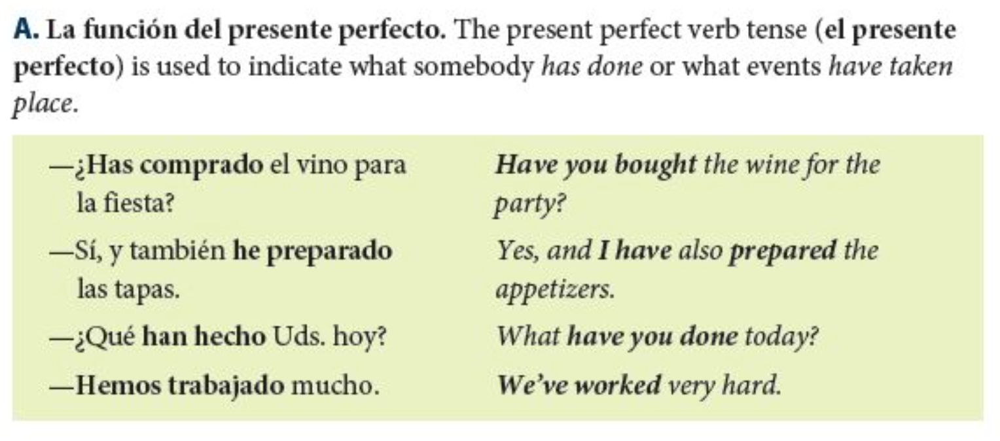

## El verbo **haber**

----------------------------------------------------------------
    Singular                   Plural
--- -------------------------- ---------------------------------
1a  yo **he** trabajado        nosotros **hemos** dormido

2a  tú **has** comido          vosotros **habéis** llegado

3a  él/ella/usted **ha** visto ellos/ellas/ustedes **han** hecho
----------------------------------------------------------------

 

> - **haber** + participio pasado = el presente perfecto

> - **¡OJO!** ¡No se pronuncia la "h"!

> - **¡Recordad!** Algunos verbos son irregulares.

## Nunca he hecho...

> - Empiezas con 5 puntos
> - Tienes que formar una frase usando el *presente perfecto*
> - Si los miembros de tu grupo han hecho lo que propones en tu frase, pierden puntos.
> - El objetivo es de NO PERDER PUNTOS
> - El último que se quede con puntos es el ganador

**Ej.**

> - Nunca **he sacado** una F en un examen.

# Descanso (10 minutos)

  

## Los horarios

  

## Las carreras

  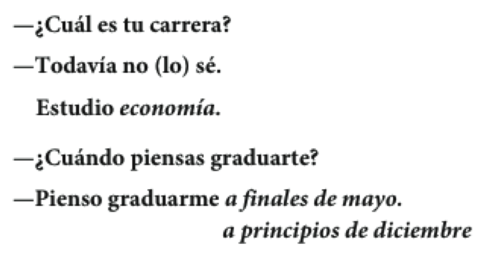

## Las carreras

  
  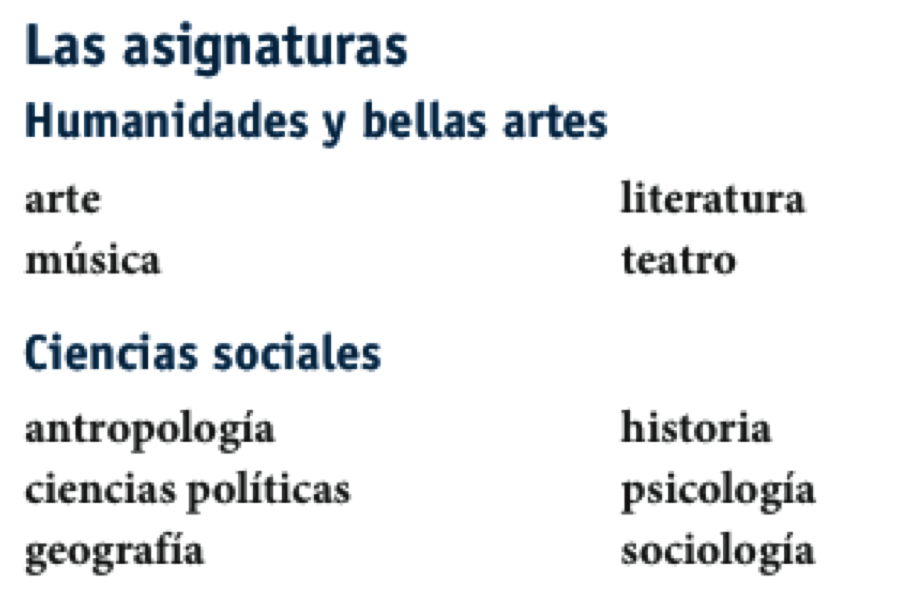  

## Cómo pedir y dar opiniones sobre las clases

  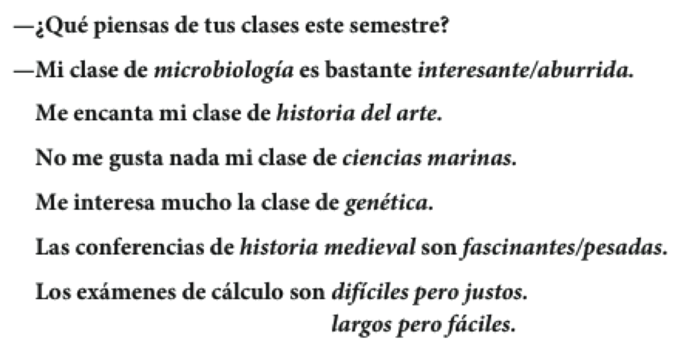

## Los profesores y las notas

    

  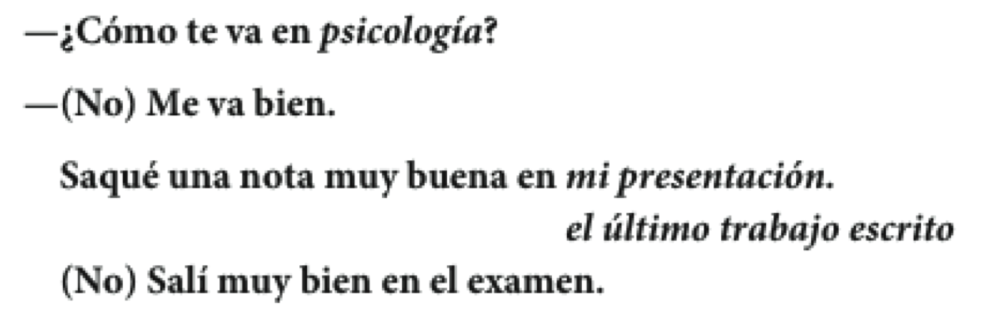

## Dos verbos como gustar: interesar y encantar

- A Sara le gusta la clase de inglés. 

- Me encanta la clase de biología. 

- Nos interesan las ciencias. 

--------------------------------------------------------------------
    Singular                       Plural
--- ------------------------------ ---------------------------------
1a  me encanta(n) / me interesa(n) nos encanta(n) / nos interesa(n)

2a  te encanta(n) / te interesa(n) os encanta(n) / os interesa(n)

3a  le encanta(n) / le interesa(n) les encanta(n) / les interesa(n)
--------------------------------------------------------------------

## Ejercicio

- 5-8, p. 164

## Como preparar una presentación con elementos visuales

> - Con un compañero, haz una lista de los elementos necesarios para hacer una buena presentación
> - Haz otra lista de las cosas que no te gusten en una presentación
> - ¿Qué sugerencias tenéis para mejorar las presentaciones orales?
> - ¿Es necesario utilizar elementos visuales? ¿Por qué?
> - ¿Cómo deben usarse?

# Repaso

---

- Vocabulario
	- El horario
	- Pedir y dar opiniones 
	- Las profesiones

- Gramática 
	- El presente perfecto
	- Encantar, interesar
	- Estrategias para hablar dell futuro
- Como preparar una presentación con elementos visuales

**Tarea**

- https://www.youtube.com/watch?v=iFUAWMMdE7c
- http://www.studyspanish.com/practice/presperfect.htm

## Con un compañero...

- ¿Qué has hecho **hoy**/**esta semana**/**este mes**/**este año**?  

- 4 oraciones, podéis mentir

## El plan

  

- Vocabulario:
	- Hablar del futuro
	- Hablar del pasado
- Gramática:
	- Pretérito

## Los planes para el futuro

  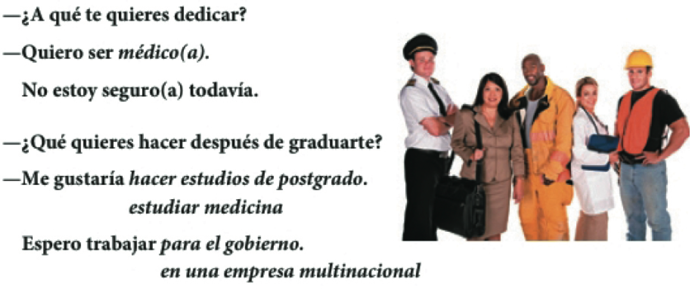

## Las profesiones y las ocupaciones

  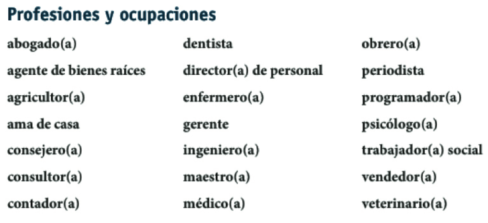

## Estrategias para hablar del futuro

  

 

> - 5-13, p. 167

## ¿Qué hiciste ayer?: el pasado

  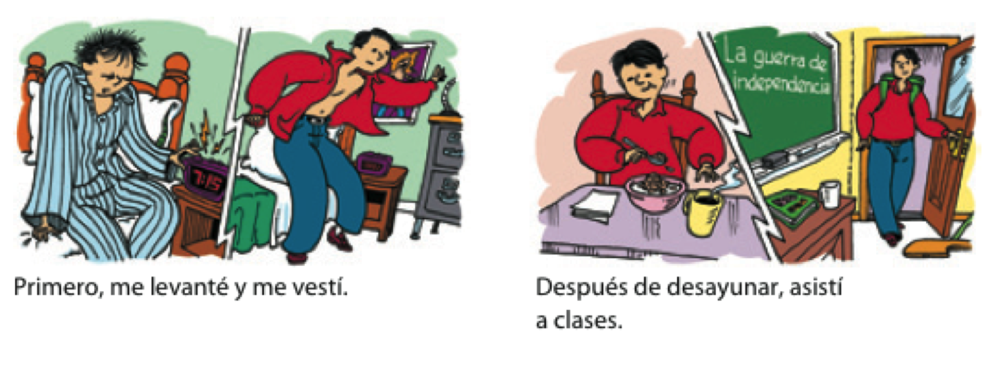

## ¿Qué hiciste ayer?: el pasado

  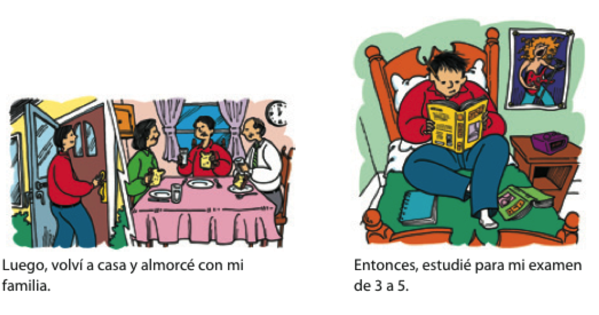

## ¿Qué hiciste ayer?: el pasado

  

## El pretérito expresa el pasado con una referencia a un tiempo particular

> - Salí con unos compañeros de clase **anoche**.

> - **Ayer** fuimos a Dos Hermanos.

> - **La semana pasada** corrimos dos millas.

> - Me bañé en el mar **el año pasado**. 

## El pretérito

  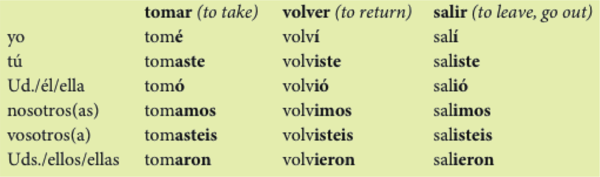

---

**¡OJO!**

> -  Los verbos reflexivos requieren el pronombre reflexivo.
	- **Me desperté** a las ocho ayer.

> -  El verbo gustar solo usa dos formas en el pretérito.
	- **Me gustó** el concierto. No **me gustaron** esas dos películas.

## Cambios ortográficos en la forma yo

> - -car   (buscar, tocar, sacar) 
	- c > qu
	- toqué, tocaste, tocó, tocamos, tocasteis, tocaron
> - -gar   (llegar, jugar, pagar) 
	- g > gu
	- llegué, llegaste, llegó, llegamos, llegasteis, llegaron
> - -zar   (empezar, almorzar) 
	- z > c
	- empecé, empezaste, empezó, empezamos, empezasteis, empezaron

## Ejercicios

- 5-19, p. 172*
- 5-20, p. 172*

## Los verbos de –er y –ir con una vocal: Leer, creer y caerse

> - Leer
	- leí, leíste, le**y**ó, leímos, leísteis, le**y**eron
- Creer
	- creí, creíste, cre**y**ó, creímos, creísteis, cre**y**eron
- Caerse
	- me caí, te caíste, se ca**y**ó, nos caímos, os caísteis, se ca**y**eron

## El pretérito expresa un momento particular en el pasado.

**Palabras importantes: ayer, anoche, la semana pasada**

- Anoche miramos la televisión.

- Mi abuela me visitó hace dos semanas.

## El pretérito expresa un evento que ocurrió varias veces

**Palabras importantes: una vez, dos veces, varias veces**

- Fuimos a la piscina dos veces la semana pasada.

## El pretérito expresa cuánto tiempo duró un evento.

**Palabras importantes: por veinte minutos, por dos días**

- Arturo habló por teléfono por quince minutos.

## El pretérito resume una experiencia (al principio o al final de una historia)

- Ayer fue un día fantástico en la uni. Primero...

## Verbos con cambios en la raíz en el pretérito: 

**e > i; o > u**

  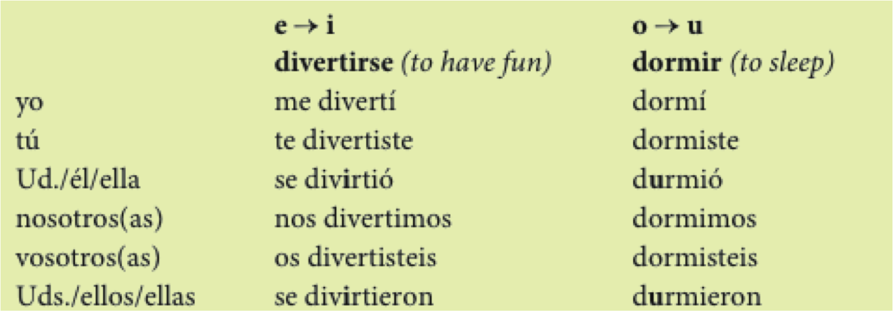

 

- ¡OJO!: Estos cambios sólo ocurren en la segunda y tercera persona (Ud., él, ella y Uds., ellos, ellas)

## Ejercicios

- 5-21, p. 174
- 5-23, p. 175

## Los verbos irregulares en el pretérito:

  

## Los verbos irregulares en el pretérito: los verbos con u en la raíz

  

## Los verbos irregulares en el pretérito: los verbos con i en la raíz

  

## Los verbos irregulares en el pretérito: los verbos con j en la raíz

  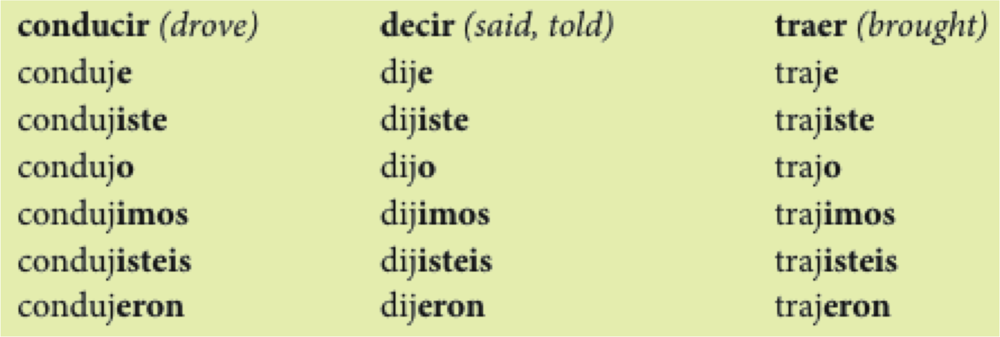

## Hay verbos con significados particulares en el pretérito.

  

## ¿Qué pasó?

<iframe width="480" height="320" src="imagenes/maya.m4v" frameborder="0" allowfullscreen></iframe>

## Prueba

## CD/CI

# Repaso - semana 3

## Gramática

> - El participio pasado
- El complemento directo
- El complemento indirecto
- El presente perfecto
- Verbos como gustar (encantar/interesar)
- Cómo hablar del futuro (usando el presente)
- El pretérito

## Vocabulario

> - Las comidas
- El mercado
- El horario
- Pedir y dar opiniones 
- Las profesiones

## El plan

  

- Vocabulario
    - hablar del pasado

- Gramática
    - el pretérito

## Resumen - los tiempos verbales

Las conversaciones normalmente incluyen el presente, el pasado y el futuro.

  

## Resumen - los tiempos verbales

El futuro puede expresarse con verbos en el tiempo presente.

> - Ir + a + infinitivo
	- **Voy a estudiar** este fin de semana.

> - Expresiones del futuro
	- La próxima semana
	- el año que viene

> - Otros verbos que expresan el futuro
	- **Pienso vivir** en la residencia el próximo semestre.
	- **Espero trabajar** en un banco en el futuro. 

## Ejercicio

- 5-13, p. 167

## Resumen - los tiempos verbales

El tiempo presente expresa las costumbres de la vida diaria.

- Palabras importantes: 
	- todos los días, frecuentemente, a menudo, a veces

> - Todos los días estudio por dos o tres horas.

## Resumen - los tiempos verbales

En este capítulo, se usa **el pretérito** para expresar el pasado. 

> - UNA acción o evento que ocurrió UNA vez.
- una SERIE de acciones en el pasado.
- una acción que DURÓ un tiempo específico.
- UN EVENTO ESPECÍFICO en el pasado.

**Palabras asociadas con el pretérito:**

> - ayer, la semana pasada, el año pasado, primero, luego
- antes de/después de + infinitivo, por último

## Ahora, identifiquen los tiempos verbales en esta conversación:

  

## Ejercicios

- 5-21, p. 174
- 5-23, p. 175

# Descanso (10 minutos)

  

## Ejercicios

- 5-29, p. 180
- 5-31, p. 180
- 5-33, p. 183
- 5-35, p. 183

## Estrategias para aprender vocabulario

> - ¿Cómo sueles aprender vocabulario nuevo? ¿En qué situaciones? ¿Con quién sueles estar?
- ¿Qué haces para recordar el vocabulario nuevo que aprendes?
- ¿Qué sugerencias tienes para aprender y memorizar vocabulario nuevo (haz una lista)?
- ¿Cómo puedes mejorar tu estrategias?

## CD/CI

- chuleta
- ejercicio

## El plan

  

- Vocabulario:
    - Excursiones académicas
- Gramática:
    - Pretérito irregular resumen de tiempos verbales
    - El condicional

## Cómo hablar de excursiones académicas

  

## Cómo hablar de excursiones académicas

  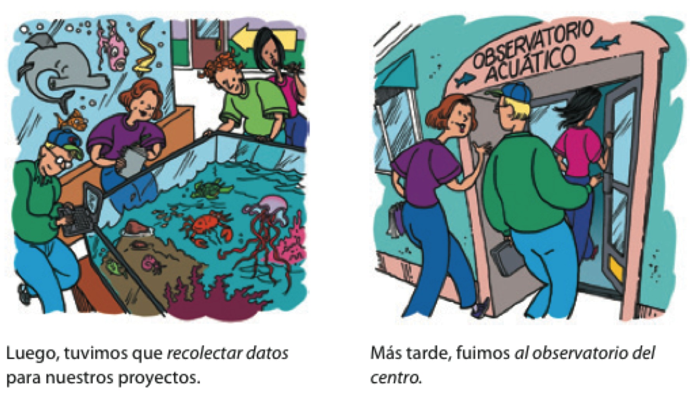

## Cómo hablar de excursiones académicas

  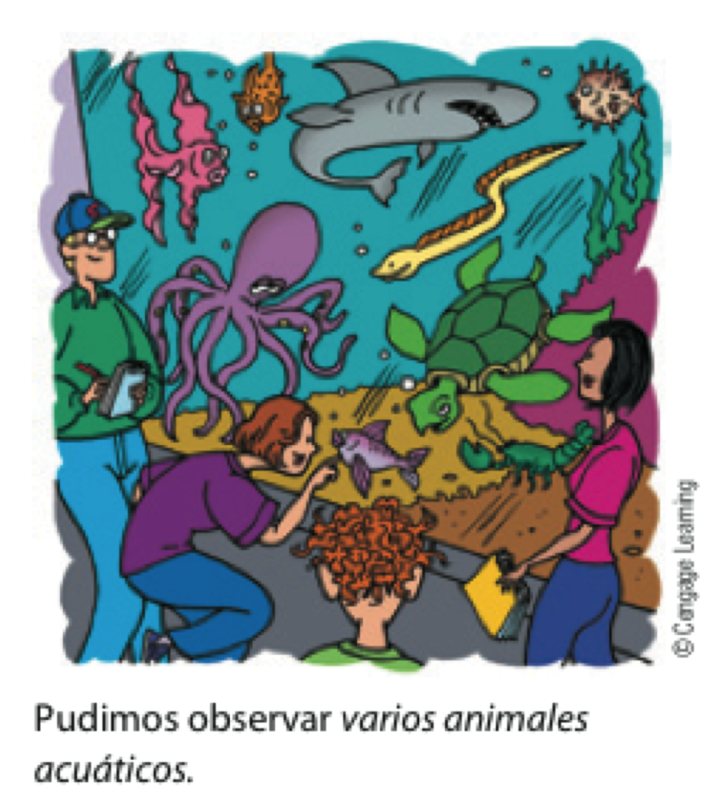

## Con un compañero

> - Describe una excursión que has hecho en el pasado
- Menciona...
    - adónde fuiste
    - qué hiciste
    - por qué fuiste
    - y cualquier otra cosa relevante

> - 5-25, p. 177

# Descanso (10 minutos)

  

## Ejercicio

- 5-35, p. 183

## El condicional (p. 343)

> - La forma **condicional** se utiliza para hablar de acciones hipotéticas o posibles
- Leed el siguiente párrafo e identificad los verbos en la forma condicional

  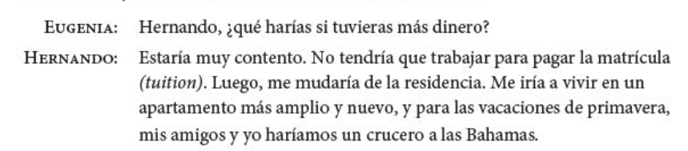

## El condicional (p. 343)

- La forma condicional describe lo que las personas ***harían*** o ***podrían*** hacer bajo ciertas circunstancias

  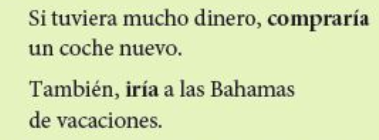

## El condicional (p. 343)

- La forma condicional se usa para indicar cortesía, sobre todo con los verbos **gustar**, **poder** y **deber**.

  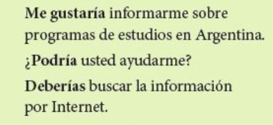

## El condicional (p. 343)

- La forma condicional se usa para indicar **probabilidad** o **duda** en el pasado

  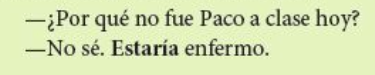

## El condicional (p. 343)

--------------------------------------------------------------------------------
forma             terminación  llegar          volver          vivir
----------------- ------------ --------------- --------------- -----------------
yo                **ía**       llegar**ía**    volver**ía**    vivir**ía**    

tú                **ías**      llegar**ías**   volver**ías**   vivir**ías**    

usted/él/ella     **ía**       llegar**ía**    volver**ía**    vivir**ía**     

nosotros          **íamos**    llegar**íamos** volver**íamos** vivir**íamos**  

vosotros          **íais**     llegar**íais**  volver**íais**  vivir**íais**   

uds./ellos/ellas  **ían**      llegar**ían**   volver**ían**   vivir**ían**    
---------------------------------------------------------------------------------

---

-----------------------------------------
Verbo   raíz irregular Ejemplos
------- -------------- ------------------
decir   dir-           Yo diría

hacer   har-           Tú harías

tener   tendr-         Nosotros tendríamos

poner   pondr-         Vosotros pondríais

cenir   vendr-         Usteden vendrían

salir   saldr-         Yo saldría

saber   sabr-          Tú sabrás

querer  querr-         Ella querría

poder   podr-          Él podría
------------------------------------------

## Ejercicio

- GS5-1, p. 344
- GS5-3, p. 345

## El pretérito (irregulares)

  

    
**tener** es tuve, **estar** es estuve  
**ir** es fui, y tambien **ser**  
**poner** es puse, **poder** es pude  
traje es para **traer**  

**hacer** hice, **haber** hube  
**saber** supe, **querer** quise  
**decir** dije, **venir** vine  
**ver** vi, **dar** di  
no acentos

